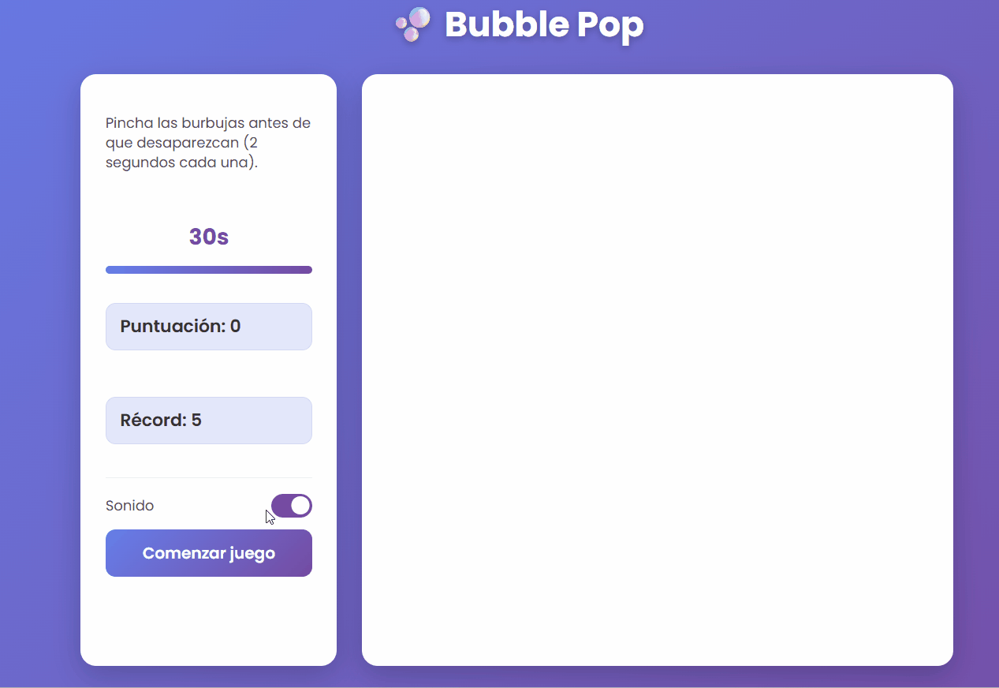

# 🫧 Bubble Pop

Juego interactivo de "cazar burbujas" desarrollado en **JavaScript puro** (sin frameworks ni librerías), donde el objetivo es pinchar el mayor número de burbujas posible antes de que desaparezcan, dentro de un tiempo límite.

## Demo

🎮 Juega aquí: **[https://ledesmamaria.github.io/bubble-pop-game/](https://ledesmamaria.github.io/bubble-pop-game/)**

## Funcionalidades

- Generación dinámica de burbujas en posiciones y colores aleatorios.
- Sistema de puntuación en tiempo real.
- Récord persistente entre sesiones usando `localStorage`.
- Temporizador de partida con barra de progreso visual.
- Control de sonido activable/desactivable (con preferencia guardada).
- Animaciones de aparición y explosión de burbujas.
- Pantalla de resultado final, con efecto de confeti al superar el récord.
- Compatibilidad cross-browser en el registro de eventos (`addEventListener` con fallback a `attachEvent`).

## Tecnologías

- HTML
- CSS (animaciones, flexbox, diseño responsive básico)
- JavaScript (ES6+), manipulación del DOM sin librerías externas
- Web Storage API (`localStorage`)
- Web Audio API (generación de sonido sin archivos externos)

## Cómo ejecutarlo en local

No requiere instalación ni dependencias. Solo hace falta:

1. Clonar el repositorio: `git clone https://github.com/ledesmamaria/bubble-pop-game.git`
2. Abrir el archivo `index.html` en cualquier navegador.

## Qué demuestra este proyecto

Este proyecto surge de una tarea del ciclo de Desarrollo de Aplicaciones Web (DAW), centrada en la gestión avanzada de eventos del navegador. Pone en práctica:

- Creación dinámica de elementos del DOM desde JavaScript, sin HTML estático previo.
- Gestión de eventos de usuario (click) de forma compatible entre navegadores.
- Persistencia de datos en el cliente sin backend, usando `localStorage`.
- Buenas prácticas de experiencia de usuario: temporizadores visibles, feedback inmediato (sonido, animaciones) y controles accesibles.

## Estructura del proyecto

bubble-pop-game/
├── index.html
├── css/
│   └── style.css
├── js/
│   └── game.js
└── juego.gif

## Autora

María Ledesma